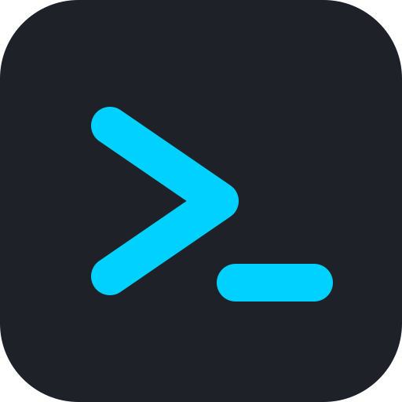

<div align="center">
  
  <h1>Cmdx24</h1>
  <p><strong>Command Execution Engine</strong></p>
  <p>A cross-platform, offline-first command reference and cheat sheet tool built for penetration testers, security engineers, and developers.</p>
</div>

<hr/>

Cmdx24 organizes complex commands, tools, and scripts into highly searchable, scenario-driven modules (like TryHackMe Cybersecurity 101, Linux Fundamentals, Offensive Security, etc.). Designed with a sleek, hacker-inspired UI, it perfectly complements your daily terminal workflow.

## ✨ Features

- **Offline-First:** All modules and commands are bundled directly with the application. No internet connection is required to search for commands during an offline engagement.
- **Scenario-Driven Navigation:** Commands are tagged with actionable scenarios (e.g., "port-scanning", "privesc") allowing you to filter by the task at hand, not just the tool name.
- **Cyberpunk Aesthetic:** Designed for long-form technical sessions with a sleek dark-mode interface, custom typography, and a distraction-free experience.
- **Quick Copy:** Seamlessly copy complex payloads and syntax straight to your clipboard with a single click.

---

## 🚀 Download & Installation

The application natively supports **Windows** and **Linux (Kali/Ubuntu/Debian)**. Pre-compiled binaries are automatically generated and published via GitHub Actions.

### Windows

1. Navigate to the [Releases Page](https://github.com/syed-faizan24/cmdx24/releases).
2. Look under the **Assets** dropdown for the latest release.
3. Download the **`.msi`** or **`.exe`** installer file (e.g., `Cmdx24_1.5.1_x64_en-US.msi`).
4. Double click to run the installer.
   > **Note:** Because the binary is self-signed, Windows SmartScreen may show a warning. To bypass it, click **More info** -> **Run anyway**.

### Linux (Kali / Debian / Ubuntu)

1. Navigate to the [Releases Page](https://github.com/syed-faizan24/cmdx24/releases).
2. Download the **`.deb`** package (e.g., `cmdx24_1.5.1_amd64.deb`).
3. Open a terminal in your download folder and install it via `dpkg`:
   ```bash
   sudo dpkg -i cmdx24_1.5.1_amd64.deb
   ```
   *(If it complains about missing dependencies, run `sudo apt --fix-broken install`)*
4. Once installed, search for **Cmdx24** in your application launcher or simply run `cmdx24` in your terminal!

---

## 🛠️ Building Manually (from Source)

If you prefer to compile the application directly from the source code, follow these steps:

### Prerequisites
- [Node.js](https://nodejs.org/) (v18+)
- [Rust & Cargo](https://rustup.rs/)

**For Linux Users:**
Ensure you have the Tauri Linux system dependencies installed:
```bash
sudo apt update
sudo apt install libwebkit2gtk-4.1-dev libappindicator3-dev librsvg2-dev patchelf
```

### Build Instructions

1. Clone the repository:
   ```bash
   git clone https://github.com/syed-faizan24/cmdx24.git
   cd cmdx24
   ```
2. Install Node dependencies:
   ```bash
   npm install
   ```
3. Run in Development Mode:
   ```bash
   npm run tauri dev
   ```
4. Build the final OS package (MSI/DEB):
   ```bash
   npm run tauri build
   ```
   *The compiled installers will be available in `src-tauri/target/release/bundle/`.*

---

## ⚠️ Disclaimer
> **Educational & Authorized Use Only**  
> The command syntax and techniques provided in this application are strictly for educational purposes and authorized security testing. You must ensure you have explicit, documented permission to test any networks or systems. The authors are not responsible for any misuse or damage caused by the use of this tool.

## 🤝 Contributing
Contributions are extremely welcome! To add new modules or commands:
1. Review the data structure in `src/types/index.ts`.
2. Add your original content to the JSON files in `src/data/`.
3. Submit a Pull Request.

## 📄 License
This project is licensed under the **MIT License**. See the `LICENSE` file for details. Developed by Syed Faizan.
